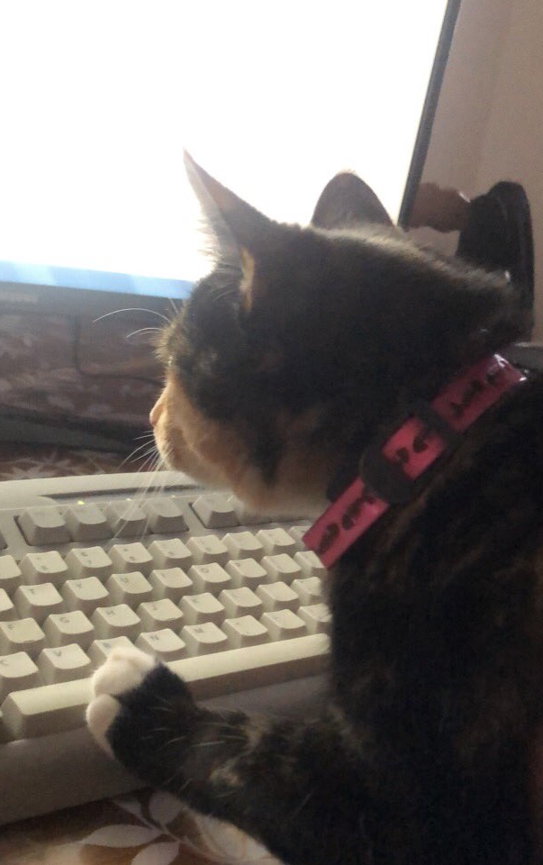
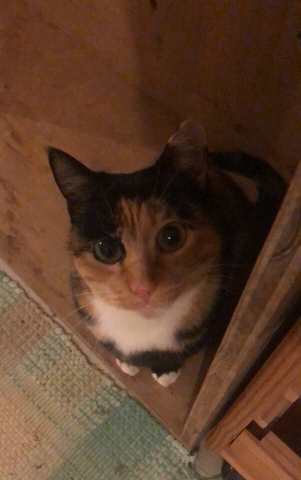

## 👋

 

  - ✔ Hi, I’m Yanis

  - 🌱 I’m currently learning everything I can
 

 

   - 💭 I'd like to make more personnal project in 2022
 
  
  

   - 🎃 I’m interested in programming, anime / manga and Olympique Lyonnais
 

 

   - 🐱‍👤 Fun fact, I love my cat
 
  
 
  

## ⚡ Stats
 

  
  

          

## 💻 Languages and Tools

  

  
  
  
  
  
  
  
  
  
  
  
  
  

  

  
  

